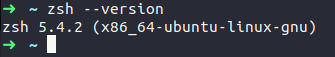

# Oh my Zsh no Linux
Tentei seguir o [post do blog da Rocketseat](https://blog.rocketseat.com.br/terminal-com-oh-my-zsh-spaceship-dracula-e-mais/) porém enfrentei alguns problemas e resolvi compartilhar todo o passo a passo que segui para conseguir usar o Zsh com o framework Oh My Zsh no 
Linux Ubuntu 18.04.  
## Guia
- [1. Instalando o Zsh](#1-instale-o-zsh)
- [2. Instalando o Oh My Zsh](#2-instale-o-oh-my-zsh)
- [3. Configurando o Oh My Zsh como terminal padrão](#configurando-o-oh-my-zsh-como-terminal-padrão)
- [Desinstalando o Zsh](#desinstalando-o-zsh)
- [Desinstalando o Oh My Zsh](#desinstalando-o-oh-my-zsh)
## 1. Instale o Zsh
Esse é o primeiro passo e o mais simples.
Digite  
  
```sudo apt install zsh```
  
na linha de comando do terminal e a instalação irá começar.  
Após a instalação terminar, confirme a instalação do Zsh, digite no terminal:  
  
```zsh --version```  
  
A resposta deve ser parecida com essa (a versão pode ser diferente):  
  

  
[Guia de instalação do Zsh - Inglês](https://github.com/ohmyzsh/ohmyzsh/wiki/Installing-ZSH) 

## 2. Configurando o Oh My Zsh como terminal padrão
Agora que o Oh My Zsh foi instalado, é necessário definí-lo como terminal padrão.  
Para isso, use o código:  
  
```chsh -s $(which zsh)```  
   
Não use sudo na frente, dará errado.  
  
Caso o anterior não funcione, tente este:  
  
```sudo chsh -s /bin/zsh```
  
Caso nenhum dos dois funcione, cheque [as respostas dessa questão num fórum](https://askubuntu.com/questions/131823/how-to-make-zsh-the-default-shell), se ainda não conseguir resolver, [tente isso](https://www.google.com/search?q=zsh+default+without+chsh) ou insira alguma questão em um fórum.  

## 3. Instale o Oh My Zsh
Para instalar o Oh My Zsh, digite:  
  
```$ sh -c "$(curl -fsSL https://raw.github.com/ohmyzsh/ohmyzsh/master/tools/install.sh)"```   
      
## Desinstalando o Zsh
Caso tenha tido problema com a instalação do Zsh e deseje desinstalá-lo para reinstalá-lo corretamente (ou por qualquer outro motivo), siga os passos:  
  
**Desinstale o Zsh do computador:**  
  
```sudo apt-get --purge remove zsh```  
  
**Agora mude o terminal para bash, o padrão:**  
  
```chsh -s /bin/bash``` 

ALguns links de respostas em fóruns que podem ser úteis caso tenha problema:  
  
[Remove Zsh from Ubuntu](https://askubuntu.com/questions/958120/remove-zsh-from-ubuntu-16-04) 
  
## Desinstalando o Oh My Zsh

Caso deseje desisntalar o Oh My Zsh, siga os passos:  
  
**Primeiro tente executar este código:**  
  
```~/.oh-my-zsh/tools/uninstall.sh```  
  
Caso não consiga, tente este outro:  
  
```rm -rf ~/.oh-my-zsh```  
  
Caso ainda não consiga, coloque o **sudo** na frente do código anterior e irá conseguir, desta forma:  
  
```sudo rm -rf ~/.oh-my-zsh``` 

[Site oficial do Oh My Zsh](https://ohmyz.sh)  
  
Alguns links de respostas em fóruns que podem ser úteis:  
  
[Troubes uninstalling oh-my-zsh](https://stackoverflow.com/questions/9813983/troubles-uninstalling-oh-my-zsh) - Esse foi o único que funcionou para mim.  
[Uninstall Oh My Zsh](https://askubuntu.com/questions/963874/uninstall-oh-my-zsh)
    